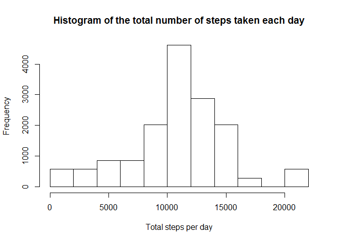
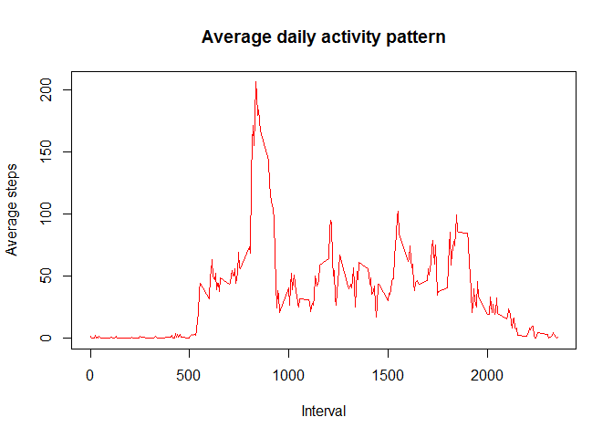
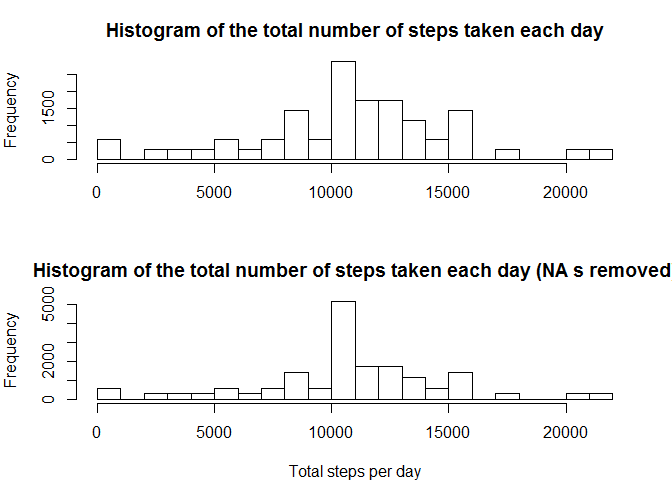
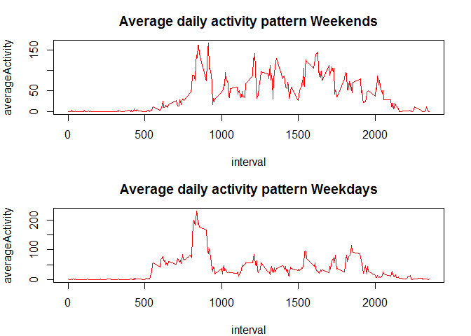

# Reproducible Research: Peer Assessment 1


## Loading and preprocessing the data

  * Load the data


```r
    activity <- data.table(read.csv("activity.csv", sep = ",", header = TRUE))
```

## What is mean total number of steps taken per day?
  * Total number of steps taken per day

```r
    activity[, totalActivity := sum(steps), by = date]
```
 
 
 
 * Mean of total number of steps taken per day

```
## [1] 10766.19
```
 
 * Median  of total number of steps taken per day

```
## [1] 10765
```

## What is the average daily activity pattern?
* Average of steps per 5-minute interval

```r
    activityPerInterval <- activity[, list(averageActivity = mean(steps, na.rm = TRUE)), by = interval]
```
 
 
 * Maximum average per 5-minulte interval

```
## [1] 206.1698
```
 
## Imputing missing values
* Total number of missing values in the data set

```
## [1] 2304
```
 
 * New data set with the missing data filled in using the average per 5-minute interval across all days.

```r
    filledActivity <- activity[, list(date, filledSteps = mean(steps, na.rm = TRUE), steps), by = interval][order(date, interval)][is.na(steps), steps := filledSteps]
```

 * Total number of steps taken per day

```r
    filledActivity[, totalActivity := sum(steps), by = date]
```
 
 

 * Mean of total number of steps taken per day

```
## [1] 10766.19
```
 
 * Median of total number of steps taken per day

```
## [1] 10765
```
 
 * Mean of total number of steps taken per day (NA s removed)

```
## [1] 10749.77
```
 
 * Median of total number of steps taken per day (NA s removed)

```
## [1] 10641
```
 
 
## Are there differences in activity patterns between weekdays and weekends?


 * Add new factor variable in the dataset with two levels -- "weekday" and "weekend" indicating whether a given date is a weekday or weekend day.

```r
    filledActivity[wday(as.Date(date)) %in% weekend, day := "weekend"]
    filledActivity[wday(as.Date(date)) %in% weekdays, day := "weekday"]
    filledActivity[,day := factor(day)]
    
    activityPerIntervalWeekends <- filledActivity[day == "weekend", list(averageActivity = mean(steps, na.rm = TRUE)), by = interval]
    activityPerIntervalWeekdays <- filledActivity[day == "weekday", list(averageActivity = mean(steps, na.rm = TRUE)), by = interval]
```
 
